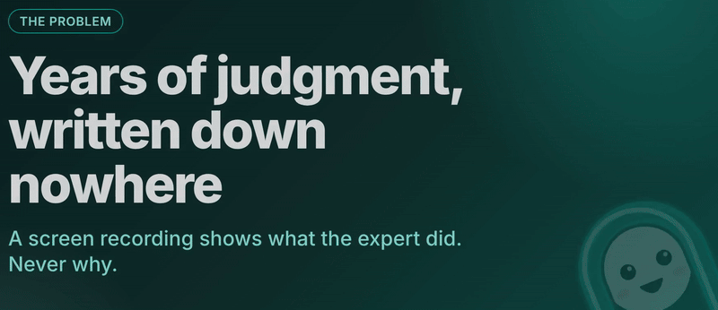
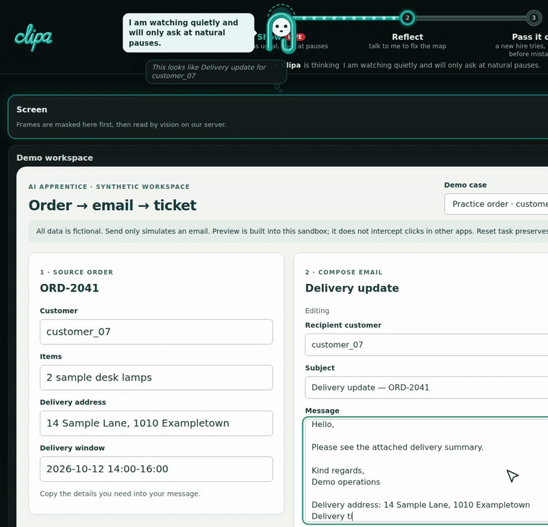
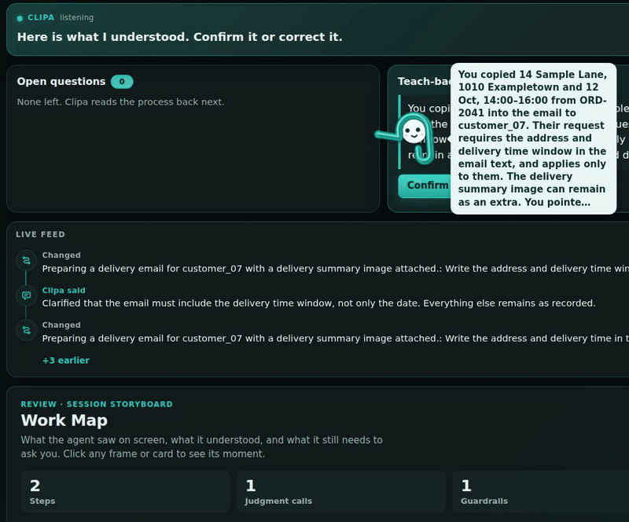
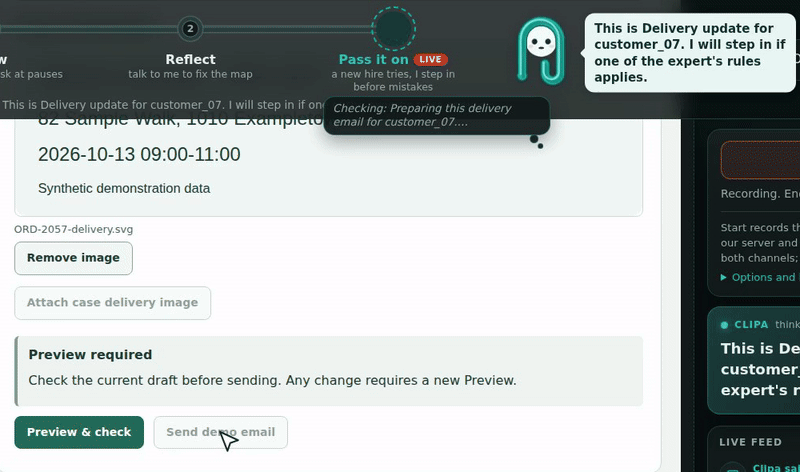
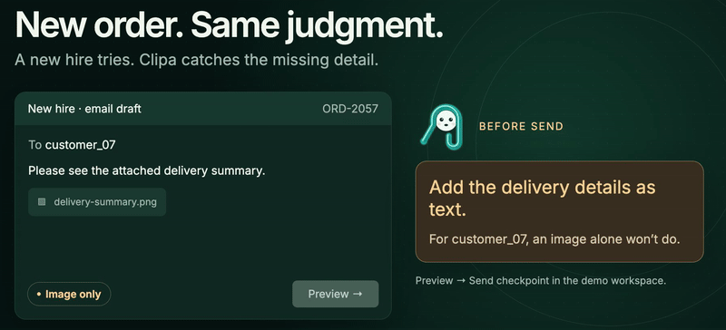
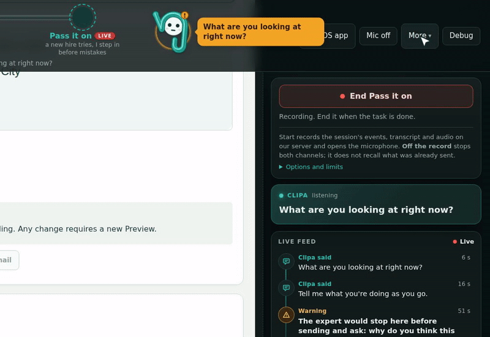
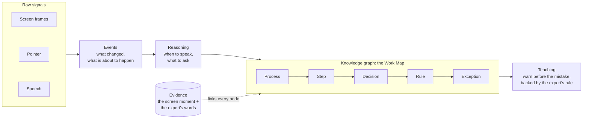
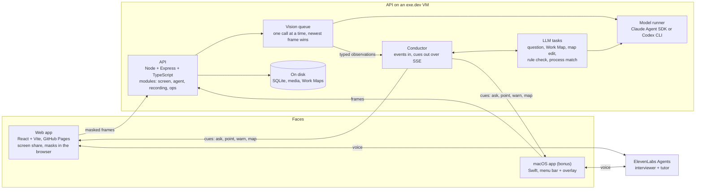

<h1 align="center">Clipa</h1>
<p align="center"><b>Clipa learns how your best people decide, teaches it to the next person, and turns it into agents that ask before they break your rules.</b></p>
<p align="center">A teal paperclip AI apprentice, as a web app with a macOS companion. Live today: Show → Reflect → Pass it on. Agents come next (see <a href="#where-this-goes">the roadmap</a>).<br>
Built at Hack-Nation 7 (Vienna, 3–4 Oct 2026) for Challenge 01, "The AI Apprentice" by ElevenLabs.</p>
<p align="center">   <a href="LICENSE"></a></p>
<p align="center"><a href="https://qwadratic.github.io/clipa/"><b>Live app</b></a> · <a href="https://qwadratic.github.io/clipa/videos/clipa-story.mp4"><b>Demo video</b></a> (0:52, illustrated) · <a href="https://qwadratic.github.io/clipa/videos/clipa-tech.mp4"><b>Tech video</b></a> (0:59) · <a href="https://github.com/qwadratic/clipa/releases/download/clipa-macos-latest/Clipa.dmg"><b>macOS app</b></a></p>
<p align="center"><br>
<sub>"Hi, I'm Clipa." · "I watch an expert work, ask why at the pauses, and coach the next person."<br>Intro animation · synthetic data · a teammate plays the expert</sub></p>

## The problem

Experts carry decisions that are written down nowhere.
A recording shows what they did, not why.
Guardrails stay invisible until someone breaks them.

Our running example is `customer_07`. For this one customer the expert writes the delivery details into the email as text, because the customer's phone blocks images. Nothing on screen says why, and a new hire would send the usual image.

## The journey

Three stages on one rail, with Clipa as the guide: [Show](#show) → [Reflect](#reflect) → [Pass it on](#pass-it-on). By voice, say "That's it" to end a stage. The header switch **Lead me through** lets Clipa move to the next stage herself. Turn it off and she only proposes it.

> [!NOTE]
> The Show, Reflect, warning and Trust clips are recorded runs of the live app. Screen events and answers in them were posted as text (marked "Simulated input · synthetic data"). Voice was off ("Voice offline"), so the bubbles are text, not audio. The hero is an intro animation and the fix clip is an illustration. Clipa's wording was tightened after the recording: questions are now at most 10 words, and a warning is one line with the fix and the expert's reason.

### Show

The expert works as usual. Clipa stays quiet while they type or talk, and asks one question at a natural pause.

<p align="center"><br>
<sub>Clipa: "I know this one: Delivery update for customer_07. I will only ask about what is different."<br>An on-screen tag marks the 10 s pause as sped up. Then she asks: "What determines whether you put customer_07's delivery address and time window in the email text or leave them in the attachment?"</sub></p>

- No questions while the expert types, talks or is away, and none while Clipa is speaking. At most 4 per 10 minutes.
- One short question (at most 10 words) about a reason, a limit or an exception behind something visible. Never about what the screen already shows.

### Reflect

When Show ends, the Work Map is already being built. Reflect opens on one rule card: the expert's words, the rule they give, its exception. Clipa asks about what is still open (up to three short points), reads the rule back, and the expert confirms or corrects it.

<p align="center"><br>
<sub>Clipa's teach-back: "...Their request requires the address and delivery time window in the email text, and applies only to them..." The banner reads "Here is what I understood. Confirm it or correct it." After Confirm it changes to "The map is confirmed. A new hire can start Pass it on now." The badge turns from "Map v3 · draft" to "Map v3 · confirmed".</sub></p>

- The answer becomes a rule for this customer only, with its exception: the details go in the email text, and an image is fine when the details are also in text.
- The teach-back is short (at most 35 words) and covers only the rules: for whom, what to do, the reason in the expert's words, the exception. The expert corrects a detail by voice, for example "it is the delivery time window, not only the date", then confirms by voice or with the Confirm button.
- Every step and rule links to its screen moment (evidence id and time range, no video replay yet) and to the expert's own words.

### Pass it on

A new hire works a case the expert never showed. Clipa steps in before a rule is broken, in the expert's name. The current build says the fix and the reason in one line (see the illustration below). The recorded run shows an earlier wording that asks.

<p align="center"><br>
<sub>New order ORD-2057, image only. Clipa: "This is Delivery update for customer_07. I will step in if one of the expert's rules applies."<br>With the pointer on Send demo email she warns: "The expert would stop here before sending and ask: why do you think this draft is ready to send?"</sub></p>

<p align="center"><br>
<sub>Illustration from the story video, not the live app. Clipa: "Add the delivery details as text. For customer_07, an image alone won't do." The tag changes from "Image only" to "Text + image", and Clipa: "Details added. Ready for review."</sub></p>

- The check runs against confirmed rules only, when a pending action appears (such as the pointer on Send) or at a pause.
- The allow case matters as much as the warning. In the demo, `customer_03` gets the same kind of email and no warning.
- She warns. She never clicks for you and never blocks another app. The checkpoint lives in our demo workspace.

### Trust

<p align="center"><br>
<sub>While Clipa asks "What are you looking at right now?", the user opens More and presses Off the record. Clipa: "Off the record: I am not watching or listening. Press Back on record to go on."</sub></p>

- **Off the record** stops screen and voice at once and cancels Clipa's pending model calls. It does not recall what was already sent.
- **Masks** are opaque rectangles you draw on a local preview. Nothing leaves the browser until you press "Confirm masks and share". They cover the screen, not speech.

## How Clipa thinks



- **Signals to events.** Frames are masked in the browser. A vision model turns each changed frame into one typed observation: which app, what changed, which control is about to be used, which regions Clipa can point at.
- **Reasoning.** One loop, the Conductor, decides when Clipa speaks. It prepares a question as soon as the screen settles and asks the moment a pause begins.
- **Knowledge.** Each step, rule and exception comes from something the expert said and a moment on screen. No scenario facts are written into prompts: the `customer_07` rule is learned live.
- **Teaching.** The tutor checks the new hire's pending action against the confirmed rules only. The outcome is clear, warn or unknown. When it cannot tell, it says unknown instead of guessing.

## Try it

> [!NOTE]
> Use Chrome or Edge on a desktop. The app needs screen sharing (`getDisplayMedia`) and the microphone. After you stop, a question or warning can take 15–20 s: the screen is read about 11 s behind. Full script: [docs/pitch/demo-script.md](docs/pitch/demo-script.md).

1. Open the [live app](https://qwadratic.github.io/clipa/) and allow the microphone when asked.
2. **Show.** Press **Start Show** and share your screen when Clipa asks. Draw masks over anything private, then press **Confirm masks and share**.
3. In the **Demo workspace** pick **Practice order · customer_07**. Press **Remove image** and type the delivery address and window into the message. Then stop: hands off the keyboard, silent. Clipa asks one short why-question. Answer in a sentence, for example "Their phone blocks images. I write the delivery details in the email."
4. Say "That's it". Clipa moves to **Reflect** by herself (say yes if she only proposes it). Answer her points, correct one detail of the read-back by voice or with **Send correction**, then say "Yes, that's right" or press **Confirm**.
5. **Pass it on** opens after Reflect. Press **Start Pass it on** and share your screen. It opens on **New order · customer_07 · attachment** (ORD-2057, image only). Type one line, keep the image and stop: Clipa warns before Send. Then type the address and window into the message. Skip **Preview & check** for now: it runs without the confirmed map.
6. Pick **Order · customer_03**, keep the image only, type a line and stop: Clipa stays quiet. Say "That's it" to end.

## Against the brief

| The brief asks | How Clipa answers | See it |
| --- | --- | --- |
| When to ask | Never while the expert types, talks or is away. She waits for a pause (1.8 s) and keeps a budget of questions. | [Show](#show) |
| What to ask | A reason, a limit or an exception behind something visible, not what the screen already shows. | [Show](#show) |
| When has it understood | Open points, then a teach-back the expert confirms or corrects. Only a confirmed map is used to teach. | [Reflect](#reflect) |
| Did the new hire learn | A case the expert never showed: Clipa warns before Send, and stays quiet where the rule does not apply. | [Pass it on](#pass-it-on) |
| Trust | Off the record, screen masks, synthetic data. Limits are listed [below](#honesty). | [Trust](#trust) |

<details>
<summary>Scenario tests T1–T6: the same case family, with expected results kept apart from the map</summary>

| Test | New case | Expected |
| --- | --- | --- |
| T1 | Same customer, image only | warn: ask for the text before Send |
| T2 | Full text plus image | clear: allow |
| T3 | Another customer | clear: do not apply the personal rule |
| T4 | Unknown customer | unknown: ask, do not guess |
| T5 | Rule corrected in Reflect | warn: apply the latest confirmed version |
| T6 | Reason unexplained or conflicting | unknown: say so |

Expected results live in `fixtures/agent/expected/t1.json` to `t6.json` and are read only by tests. The tests run on the in-browser tutor in `packages/agent` (`npm test --workspace @apprentice/agent`). In the live app the Conductor's rule check runs on the model.

</details>

## Architecture



- **Browser.** `getDisplayMedia`, masks painted before encoding, a frame about every 1.5 s, voice through `@elevenlabs/client`.
- **Screen module.** Changed frames become typed observations with evidence, stored in SQLite and on disk. The contract between capture and agent is ScreenBridge v1 ([packages/contracts](packages/contracts/README.md)): the checkpoint reply is `{checkpointId, status: clear | warn | unknown, message, evidenceIds}`, and every timestamp counts from one `sessionEpochMs`.
- **Conductor.** Events in, cues out over SSE. Prompts are generic, input is wrapped as untrusted JSON, and every model output is parsed and checked.
- **Voice.** ElevenLabs Agents play the interviewer and the tutor. The app decides when Clipa speaks. The key stays on the server and the browser gets a signed URL.

## Tech stack

| Layer | Tech |
| --- | --- |
| Web app | React 19, Vite 7, TypeScript, GitHub Pages |
| Voice | ElevenLabs Agents (interviewer and tutor), `@elevenlabs/client`, a signed URL from the API |
| API | Node (22.22 or newer), Express 5, TypeScript, SQLite (`node:sqlite`) and media on disk, an exe.dev VM under systemd |
| Model runner | Claude Agent SDK engine or Codex CLI engine, switched by `RUNNER_ENGINE` |
| Screen | `packages/screen`: browser capture, masks, vision queue, evidence, processed recording. Contract: ScreenBridge v1 |
| macOS | Swift, ScreenCaptureKit, no external dependencies |
| Videos | Remotion, a Playwright journey recorder, ElevenLabs text-to-speech voice-over |
| Delivery | Each code merge to `release`: GitHub Actions builds Pages, a signed webhook deploys the VM with a health check and automatic rollback ([infra](infra/README.md)) |

## Deploy

The live app and API deploy from the `release` branch. `main` is frozen as the Hack-Nation submission snapshot (the commit judges can check out); everything after submission, including this kind of housekeeping, lands on `release` through pull requests instead.

## Honesty

- All data is synthetic. A teammate plays the expert, and the answers in the recorded runs are written by a teammate.
- Both videos use AI voices. The demo video is illustrated: Clipa's lines in it are illustrative, not live output. The tech video mixes diagrams with live cuts of the app. In those cuts screen events and answers are posted as text (marked "Simulated input") and the app's voice is offline.
- The checkpoint works in our demo workspace only. Clipa warns. She never clicks for you and never blocks another app.
- Off the record stops screen and voice. It does not recall what was already sent. "Start" records the session's events, transcript and audio on our server, and a session ends after 10 minutes.
- Masks cover the screen, not speech. Fixed rectangles do not follow scrolling text, there are no masks on macOS frames, and there is no automatic PII redaction.
- Each step and rule links to its screen moment by evidence id and time. A video replay of that moment is not wired into the Work Map yet.
- The recorded runs used the model runner's Codex CLI engine. It reads the screen about 11 s behind, so a question or warning can come 15–20 s after you stop.

## Bonus: Clipa for macOS

A lighter face of the same Clipa: a menu-bar app with a click-through overlay, written in Swift for macOS 14+. It uses the same server and hands Reflect over to the web app.

1. Download [Clipa.dmg](https://github.com/qwadratic/clipa/releases/download/clipa-macos-latest/Clipa.dmg) and drag Clipa to Applications.
2. The app is not notarized. On first launch open System Settings > Privacy & Security and press **Open Anyway**.
3. Grant Screen Recording, Microphone and Input Monitoring, then reopen the app.

It covers the main display only and has no screen masks, so use the web app for anything private. Details: [mac/README.md](mac/README.md).

## Repo map

```text
apps/web            React web app: shell, journey rail, Conductor client, Work Map board, voice, demo workspace
apps/api            Node/Express API: agent (Conductor, LLM tasks, ElevenLabs), screen (vision, evidence), recording, ops
packages/contracts  ScreenBridge v1: types, validators, fixtures
packages/screen     Browser capture with masks, vision queue, evidence, processed recording
packages/agent      In-browser fallback brain and the T1–T6 tutor tests
fixtures/agent      Synthetic inputs, expected results, recorded model outputs
infra               Model runner, deploy webhook, systemd units, deploy script
mac                 Clipa for macOS (bonus)
video               Remotion toolkit, journey recorder, voice-over muxer
docs                Pitch docs, integration notes, README clips (docs/media)
backlog             Tasks and plans (Backlog.md)
scripts, sandbox    Dev launcher and test runner; static pages from the first macOS prototype
```

Package names (`@apprentice/*`) and the API host (`apprentice.exe.xyz`) keep the project's first name, AI Apprentice.

## Run locally

```bash
nvm use && npm ci        # Node 22.22, see .nvmrc
npm run check            # typecheck, tests (700+) and build

# The API reads its settings from the shell. Use absolute paths outside the repo.
export HOST=127.0.0.1 PORT=8000
export DATABASE_PATH=/abs/db/apprentice.sqlite      # its folder must exist
export MEDIA_DIR=/abs/media SESSIONS_DIR=/abs/sessions AGENT_MAPS_FILE=/abs/maps.json
export ALLOWED_ORIGINS=http://127.0.0.1:5173,http://localhost:5173
npm run dev              # API on :8000, web on http://127.0.0.1:5173
```

- **Voice** needs `ELEVENLABS_API_KEY` (server side only) and `ELEVENLABS_AGENT_ID_INTERVIEWER`, optionally `ELEVENLABS_AGENT_ID_TUTOR`. Without them the signed-URL route answers `elevenlabs_not_configured`.
- **Model calls** need `RUNNER_URL` and `RUNNER_TOKEN`, and a running `infra/claude-runner` with `RUNNER_CWD` and one of `CLAUDE_CODE_OAUTH_TOKEN` or `ANTHROPIC_API_KEY` (or `RUNNER_ENGINE=codex`). Never commit secrets; `.env.example` lists the names.

## Where this goes

The confirmed Work Map is what an AI agent lacks today: not what to click, but why.

| Stage | What Clipa does | Status |
| --- | --- | --- |
| 1. Apprentice | Watches any app, asks why at pauses, builds and confirms the Work Map by voice | Working in the live app |
| 2. Tutor | Coaches a new hire on a new case and warns before a rule is broken | Working in the live app |
| 3. Memory | Recognises a learned process and asks only about what is different | First version |
| 4. Agent maker | Exports a confirmed process as agent instructions and serves its guardrails over MCP, so an agent can ask "would the expert stop here?" | Next |
| 5. Supervisor | Watches the agents the way she watched the expert | Moonshot |

The moonshot: a company memory that asks only about what changed. More in [docs/pitch/vision.md](docs/pitch/vision.md).

## Team

<table><tr>
<td align="center" width="50%"><a href="https://github.com/qwadratic"><br><b>Ivan</b></a><br>@qwadratic<br><sub>Project lead · Voice, Conductor, Work Map, tutor, app shell</sub></td>
<td align="center" width="50%"><a href="https://github.com/kigulx"><br><b>Kyrylo</b></a><br>@kigulx<br><sub>Capture, masks, vision, demo workspace, repo skeleton</sub></td>
</tr></table>

## Credits and license

- [ElevenLabs](https://elevenlabs.io): Agents for the voice, text-to-speech for the video voice-over.
- [Anthropic](https://www.anthropic.com): the Claude Agent SDK, and Claude Code for much of the code. The Codex CLI is the model runner's second engine.
- [Hack-Nation](https://hack-nation.ai): the 7th Global AI Hackathon, Vienna hub, and Challenge 01 by ElevenLabs.
- [Clicky](https://github.com/farzaa/clicky) by Farza (MIT): the overlay, menu-bar and permission patterns in the macOS app. See [mac/THIRD_PARTY_NOTICES.md](mac/THIRD_PARTY_NOTICES.md).
- Built by two people with coding agents (see `CLAUDE.md` and `AGENTS.md`). Released under the [MIT license](LICENSE).
