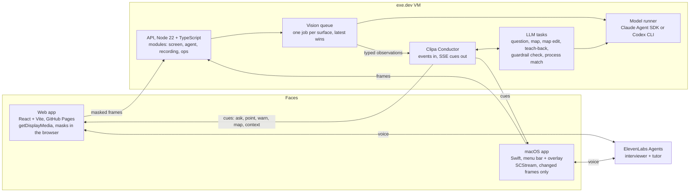

# Technical walkthrough: the tech video

This is the submission's tech video: how Clipa is built and why that is hard (TASK-3.19).

- **Length:** target 2:00. Confirm the length rule in Discord before the final edit.
- **Narrator:** Ivan, in English.
- **Footage:** the architecture diagram below, the live feed and debug view of the real app, short code close-ups and the CI page.

## Architecture

## Shot list (2:00)

| Time | Picture | Voice-over |
| --- | --- | --- |
| 0:00–0:10 | Title, then the diagram. | "Clipa turns an expert's screen and voice into a confirmed Work Map, then coaches the next person. Here's how." |
| 0:10–0:30 | The web share with the mask overlay, then a `screen_activity` JSON: app, surface, summary, pending action, regions with boxes. | "Frames are masked in the browser before anything leaves it. On the server, every changed frame becomes one typed observation, in one contract for any app: what's open, what changed, the control about to be used, and labelled regions Clipa can point at." |
| 0:30–0:55 | The live feed: a `quiet` reason (the person is typing), then an `ask` pointing at a region. | "One server loop, the Conductor, decides when Clipa speaks, for the web and the Mac alike. It never speaks while you type or talk. It prepares the question as soon as the screen settles and asks the moment a pause begins. A reworded description of the same screen doesn't count as a change." |
| 0:55–1:15 | Reflect: the board grouped by process, a step with its screen moment and the expert's quote, then a voice correction changing a rule. | "When Show ends, the Work Map is already being built: processes, steps tied to screen moments, and each rule in the expert's own words. Clipa raises the open points, reads it back, and the expert corrects it just by talking." |
| 1:15–1:30 | Pass it on: the warning before Send, with the expert's moment replayed. | "On a new case, a guardrail check runs on every pending action against the confirmed rules only. The tutor warns before the mistake and replays the expert's moment. It never blocks the other app." |
| 1:30–1:48 | The CI page, the Backlog board, then two PRs from two streams. | "Two people and their agents built this in parallel in one day: contracts first, more than 700 automated tests, CI on every pull request, and a deploy on every merge with a health check and automatic rollback. The model runner is engine-agnostic. When our Claude quota ran out an hour before the pitch, we switched it to the Codex CLI without touching the product." |
| 1:48–2:00 | The Clipa logo. | "Next: a company memory that only asks about what changed." |

## Facts behind the lines (check before recording)

- **Contract.** ScreenBridge v1 (`packages/contracts`, backlog TASK-1 and doc-7) defines the kinds `order_view`, `email_draft`, `ticket` and the generic `screen_activity`. Region boxes are `[x, y, w, h]` normalised 0..1.
- **Conductor.** `apps/api/agent/conductor/` (doc-12).
  - Timing: pause 1.8 s, settle 0.5 s, at least 15 s between questions, at most 2 open points in Reflect, a teach-back of about 60 words.
  - The screen goes to the voice agent as contextual updates.
- **LLM tasks.** `apps/api/agent/llm-tasks.ts`.
  - Prompts are pinned by hash in tests.
  - No scenario facts are written into prompts: the rule must be learned live.
- **Runner.** `infra/claude-runner`. `RUNNER_ENGINE=claude|codex`; JSON schemas are converted for OpenAI strict mode.
- **Deploy.** `release.yml`, then a signed webhook, then `deploy.sh`: build, health check, automatic rollback.
- **Test count.** On main at 07:40 UTC: web 247, agent package 190, API 96, screen 164, contracts 24.

## Honesty lines (keep them)

- "A teammate plays the expert; all data is synthetic."
- "Masks protect the screen, not speech. Off the record stops screen, voice and model calls; it does not recall what was already sent."
- "Confirmed maps live in server memory: one team, one demo server."
- "On Codex, vision is slower than on Claude (about 15 s against about 2 s per frame)."
